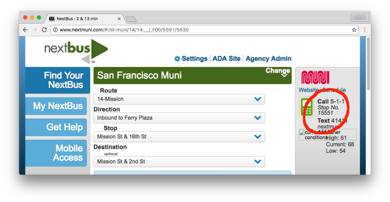

## &nbsp; Quickly find bus arrivals

Resisting the smartphone? Here's a Twilio app to help you hold out.
The idea is that you define city regions and then use region codes
on your phone keypad to find the next buses going from one region
to another. Unlike the standard city-provided 511 service this one
is impervious to background noise, infinitely patient for you to
make a selection, and aggregates predictions for all nearby stops.

---

### Step One: Define Regions

Think of general areas where you want to catch a bus: by your house,
job, or places where it's common to make transfers. Use Google maps
to find the best bus routes from A to B. Next visit
[nextmuni.com](http://www.nextmuni.com) to obtain muni ids for the
stops recommended by Google.

<p align="center">
  
</p>

In the image above, the stop id `15551` is circled in red. We'll
omit the leading digit of this number in the dumbus configuration.

### Step Two: Create connections.csv

Its format is

```
region_from,region_to,stop_id,route_number
```

The regions are up to you, each is named by a number from zero to
nine.  Suppsing we had designated the Mission as region one and the
financial district as region two we would add these lines to
connections.csv:

```csv
1,2,5551,14
```

### Step Three: Deploy

This program compiles into a single binary. To build dumbus, [install
Stack](http://docs.haskellstack.org/en/stable/README.html#how-to-install)
the Haskell build tool, and run this:

```bash
git clone https://github.com/begriffs/dumbus.git
cd dumbus
stack build --install-ghc
sudo stack install --allow-different-user --local-bin-path /path/for/binary

# the binary requires the mp3 file for its greeting beep
cp -R static /path/for/binary
```

This runs a server that listens on port 4321 and serves TwiML.
Purchase a number on Twilio and create a webhook for incoming voice
calls that points to `http://yourserver.com:4321`.

---

## Using the app

Assign a speed-dial key for this app if your phone supports it.
When you call the app, and it answers immediately with a short beep.
It is waiting for a query. They are of two forms: `XY#` or `X#`
(for instance `12#`).

The first will tell you the next departures from region X to Y
ordered soonest first. The second form lists departures from region
X to any other region.

The app will rapidly recite route numbers and times. At any point
you may interrupt it with another query. It's really fast to find
the best routes and transfers.
